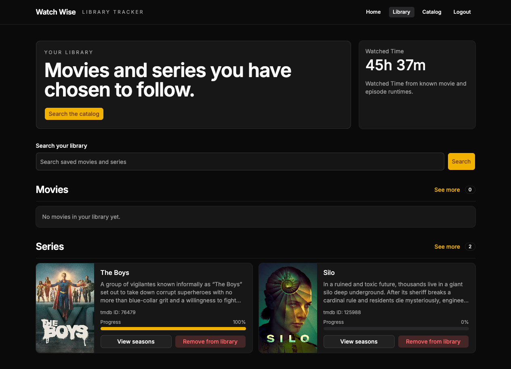

# Watch Wise

Watch Wise is a personal watch-tracking app for movies and series. It lets a user search a catalog, save titles to their library, and track watched movies and episodes over time.

The app keeps the catalog separate from the user's library: external providers supply searchable movie and series data, while Watch Wise stores the user's saved entries, watched marks, and derived progress.

## Project Intent

Watch Wise is a personal project built to solve my own watch-tracking workflow. I am not maintaining it as a product or promising support for features that fit other people's needs.

The code is licensed under MIT, and you are welcome to read it, fork it, clone it, and build on top of it if it is useful to you.



## Stack

- AdonisJS 7
- Inertia + React 19
- SQLite through Lucid
- Tailwind CSS 4 and shadcn/ui
- Bun
- TMDB as the real catalog provider, with a fake provider for test

## Requirements

- Bun 1.4.0
- SQLite support through the installed `sqlite3` package
- A TMDB access token only when using `CATALOG_PROVIDER_DRIVER=tmdb`

## Setup

Install dependencies:

```bash
bun install
```

Create the local environment file:

```bash
cp .env.example .env
```

The `.env.example` file starts with the fake catalog provider only as a safe default. For development and real execution, use TMDB instead.

Required environment variables from `start/env.ts`:

| Variable                  | Required when                            |
| ------------------------- | ---------------------------------------- |
| `NODE_ENV`                | Always                                   |
| `PORT`                    | Always                                   |
| `HOST`                    | Always                                   |
| `LOG_LEVEL`               | Always                                   |
| `APP_KEY`                 | Always                                   |
| `APP_URL`                 | Always                                   |
| `SESSION_DRIVER`          | Always                                   |
| `CATALOG_PROVIDER_DRIVER` | Always                                   |
| `TMDB_ACCESS_TOKEN`       | Only when `CATALOG_PROVIDER_DRIVER=tmdb` |

`DATABASE_NAME` and `CACHE_ENABLED` are optional; the app has defaults when they are not set.

Prepare the database:

```bash
bun run db:reset
```

Start the development server:

```bash
bun run dev
```

By default the app runs at `http://localhost:3333`.

## Catalog Provider

For development and real execution, use TMDB:

```env
CATALOG_PROVIDER_DRIVER=tmdb
TMDB_ACCESS_TOKEN=your_token
```

The fake provider is intended for tests and controlled scenarios only:

```env
CATALOG_PROVIDER_DRIVER=fake
```

## Seerr Webhook

Optional integration: Seerr can notify this app through `POST /api/webhooks/seerr` so a `MEDIA_AUTO_APPROVED` request automatically adds the movie or serie to the user's library.

Configure it with two optional env vars:

```env
SEERR_USER=your_username_or_email
SEERR_AUTH_HEADER=your_secret
```

- `SEERR_AUTH_HEADER` is the value the `Authorization` header of the webhook request must match.
- `SEERR_USER` is the **username or email of the Watch Wise user** that will receive the titles in their library. The webhook only processes requests whose requestedBy username or email matches it, so the username or email used in Seerr **has to be the same as the one registered in this app and set in `SEERR_USER`**.

When the vars are not set the endpoint responds `503` and the rest of the app is unaffected.

## Docker Environment

The Docker image provides defaults for `NODE_ENV`, `HOST`, `PORT`, `LOG_LEVEL`, `APP_URL`, `SESSION_DRIVER`, `DATABASE_NAME`, and `CATALOG_PROVIDER_DRIVER`. The Docker default catalog provider is TMDB, and the default database path is `data/db.sqlite3`.

You still need to pass secrets and provider credentials at runtime:

```bash
docker run -p 3333:3333 -e APP_KEY=your_app_key -e TMDB_ACCESS_TOKEN=your_token watch-wise
```

Any Docker default can be overridden with `-e`, for example `-e PORT=8080`.

## Useful Commands

```bash
bun run dev          # start the app in watch mode
bun run start        # start the server without watch mode
bun run db:reset     # recreate and seed the local SQLite database
bun run lint         # run ESLint
bun run typecheck    # run TypeScript checks
bun run vite:build   # build frontend assets
```

Project terminology lives in `CONTEXT.md`. Architectural decisions live in `docs/adr/`.
